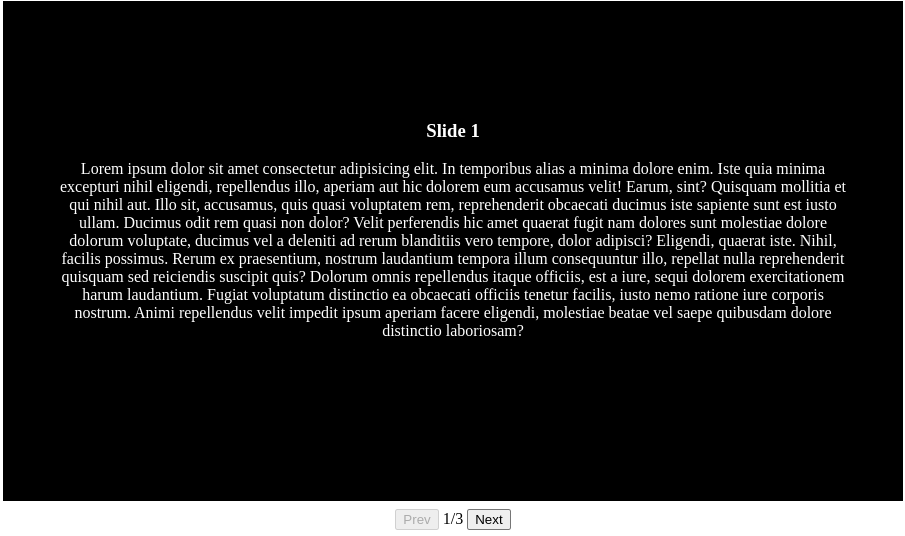
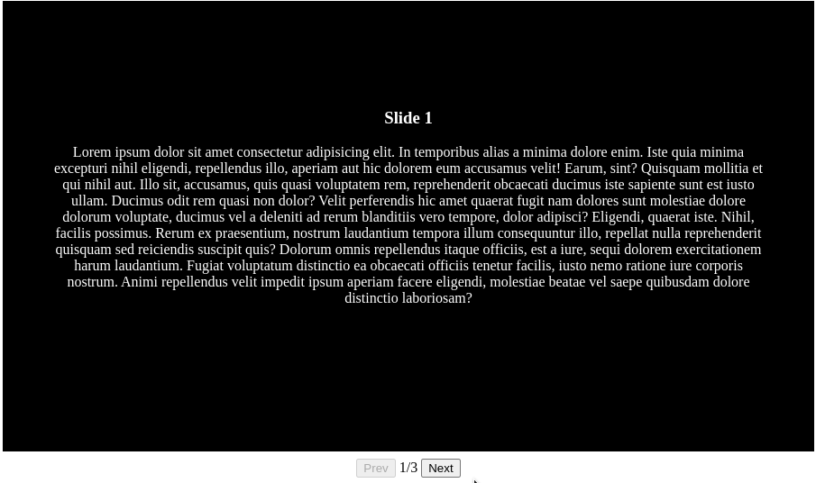
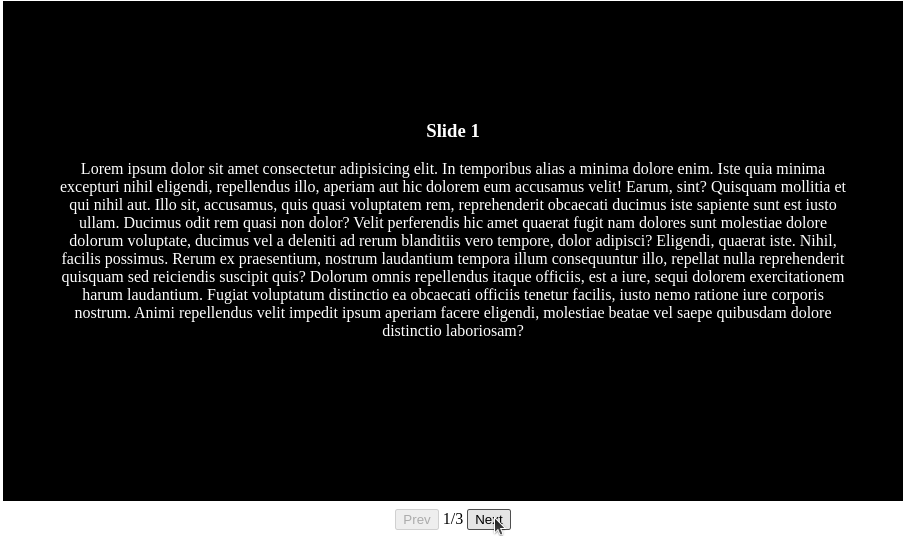

# Текстуален слајдер

#### Тежина: <span style="color: orange">Напредна</span>

Во оваа вежба, ќе креирате анимиран слајдер со текстуални слајдови користејќи ја библиотеката anime.js.

Ќе дизајнирате визуелно привлечен и функционален слајдер кој овозможува премин од еден слајд на друг. Следете ги упатствата и користете ги обезбедените ресурси и совети за да ја завршите вежбата.

- Додадете слајдер со 3 слајдови со произволна содржина. Слајдерот треба да биде центриран на екранот и да покажува само еден слајд во еден момент.
- Додадете копчиња за премин на претходниот (Prev) и следниот (Next) слајд, и индикатор за тековниот слајд
- При клик на копчето "Prev", тековниот слајд се заменува (fade out) со претходниот слајд (fade in).
- При клик на копчето "Next", тековниот слајд се заменува со следниот слајд со анимација fade in и fade out.
- При секоја акција на премин на слајдовите, ажурирајте го индикаторот за тековниот слајд за да го прикаже точниот слајд.
- Оневозможете ги копчињата "Prev" и "Next" соодветно кога тековниот слајд е првиот или последниот.

Должината на Анимацијата треба да биде вкупно 2 секунди

> **Помош:** Користете го CSS својството "opacity" за да креирате ефект на исчезнување и појавување.

### Почетен код

```html
<!doctype html>
<html lang="en">
  <head>
    <meta charset="UTF-8" />
    <meta name="viewport" content="width=device-width, initial-scale=1.0" />
    <title>Slider</title>

    <script src="https://cdnjs.cloudflare.com/ajax/libs/animejs/3.2.2/anime.min.js"></script>
  </head>
</html>
```

### Очекуван резултат


### Корисни ресурси и насоки

### Решение

```html
<!doctype html>
<html lang="en">
  <head>
    <meta charset="UTF-8" />
    <meta name="viewport" content="width=device-width, initial-scale=1.0" />
    <title>Slider</title>

    <script src="https://cdnjs.cloudflare.com/ajax/libs/animejs/3.2.2/anime.min.js"></script>

    <style>
      .slides {
        display: flex;
        position: relative;
        width: 900px;
        height: 500px;
        justify-content: center;
        align-items: center;
        background-color: black;
        color: white;
        overflow: hidden;
        margin: auto;
      }

      .slide {
        position: absolute;
        width: 800px;
        height: 300px;
        padding: 8px;
        text-align: center;
      }

      .pagination {
        margin-top: 8px;
        text-align: center;
      }
    </style>
  </head>

  <body>
    <div class="slides">
      <div class="slide">
        <h3>Slide 1</h3>
        <p>
          Lorem ipsum dolor sit amet consectetur adipisicing elit. In temporibus
          alias a minima dolore enim. Iste quia minima excepturi nihil eligendi,
          repellendus illo, aperiam aut hic dolorem eum accusamus velit! Earum,
          sint? Quisquam mollitia et qui nihil aut. Illo sit, accusamus, quis
          quasi voluptatem rem, reprehenderit obcaecati ducimus iste sapiente
          sunt est iusto ullam. Ducimus odit rem quasi non dolor? Velit
          perferendis hic amet quaerat fugit nam dolores sunt molestiae dolore
          dolorum voluptate, ducimus vel a deleniti ad rerum blanditiis vero
          tempore, dolor adipisci? Eligendi, quaerat iste. Nihil, facilis
          possimus. Rerum ex praesentium, nostrum laudantium tempora illum
          consequuntur illo, repellat nulla reprehenderit quisquam sed
          reiciendis suscipit quis? Dolorum omnis repellendus itaque officiis,
          est a iure, sequi dolorem exercitationem harum laudantium. Fugiat
          voluptatum distinctio ea obcaecati officiis tenetur facilis, iusto
          nemo ratione iure corporis nostrum. Animi repellendus velit impedit
          ipsum aperiam facere eligendi, molestiae beatae vel saepe quibusdam
          dolore distinctio laboriosam?
        </p>
      </div>

      <div class="slide">
        <h3>Slide 2</h3>
        <p>
          Dolores accusantium maxime magnam minima distinctio commodi ab,
          debitis fuga cumque eum doloribus voluptatem veniam aliquid magni
          libero hic aspernatur a cum maiores dolor. Iusto officiis dolores
          aliquam facilis quis? Officia, voluptatem blanditiis? Inventore quis
          porro rem magnam nobis totam omnis eveniet? Quae impedit esse saepe
          non, eos aliquam quaerat in animi iste ipsam ipsa officiis. Illo
          assumenda dolorem in? Quisquam quaerat eos itaque sit magni adipisci
          dolorem quidem dolor aliquid at optio, corrupti sint praesentium eum
          accusamus perspiciatis vero earum incidunt? Sunt neque debitis beatae,
          quaerat labore doloremque ea! Vel illum, distinctio voluptas
          laboriosam repudiandae omnis necessitatibus temporibus veritatis ea
          quod mollitia neque incidunt? Accusantium veniam incidunt rerum quos,
          doloremque veritatis suscipit enim tempora quas odio, eveniet,
          provident possimus? Vero itaque placeat earum natus? Illo enim
          perspiciatis expedita molestiae! Fuga necessitatibus distinctio, nulla
          facere vel repellat accusantium a. Optio quibusdam vel distinctio
          aperiam. Temporibus doloribus accusantium aut eaque harum.
        </p>
      </div>

      <div class="slide">
        <h3>Slide 3</h3>
        <p>
          Dolores accusantium maxime magnam minima distinctio commodi ab,
          debitis fuga cumque eum doloribus voluptatem veniam aliquid magni
          libero hic aspernatur a cum maiores dolor. Iusto officiis dolores
          aliquam facilis quis? Officia, voluptatem blanditiis? Inventore quis
          porro rem magnam nobis totam omnis eveniet? Quae impedit esse saepe
          non, eos aliquam quaerat in animi iste ipsam ipsa officiis. Illo
          assumenda dolorem in? Quisquam quaerat eos itaque sit magni adipisci
          dolorem quidem dolor aliquid at optio, corrupti sint praesentium eum
          accusamus perspiciatis vero earum incidunt? Sunt neque debitis beatae,
          quaerat labore doloremque ea! Vel illum, distinctio voluptas
          laboriosam repudiandae omnis necessitatibus temporibus veritatis ea
          quod mollitia neque incidunt? Accusantium veniam incidunt rerum quos,
          doloremque veritatis suscipit enim tempora quas odio, eveniet,
          provident possimus? Vero itaque placeat earum natus? Illo enim
          perspiciatis expedita molestiae! Fuga necessitatibus distinctio, nulla
          facere vel repellat accusantium a. Optio quibusdam vel distinctio
          aperiam. Temporibus doloribus accusantium aut eaque harum.
        </p>
      </div>
    </div>

    <div class="pagination">
      <button id="btnPrevSlide">Prev</button>

      <span id="pageCurrent">1</span>/<span id="pageTotal">0</span>

      <button id="btnNextSlide">Next</button>
    </div>
  </body>

  <script>
    const slides = document.querySelectorAll(".slide");
    let currentSlideIndex = 0;

    const btnPrevSlide = document.getElementById("btnPrevSlide");
    const btnNextSlide = document.getElementById("btnNextSlide");

    // Hide all slides except the first one
    for (let i = 1; i < slides.length; i++) {
      slides[i].style.opacity = 0;
    }

    btnPrevSlide.addEventListener("click", () => {
      if (currentSlideIndex === 0) return;

      const previousSlide = slides[currentSlideIndex - 1];
      const currentSlide = slides[currentSlideIndex];

      anime({
        targets: currentSlide,
        opacity: [1, 0],
        duration: 1000,
      });

      anime({
        targets: previousSlide,
        opacity: [0, 1],
        duration: 1000,
        delay: 1000,
      });

      currentSlideIndex--;

      updatePagination();
    });

    btnNextSlide.addEventListener("click", () => {
      if (currentSlideIndex === slides.length - 1) return;

      const currentSlide = slides[currentSlideIndex];
      const nextSlide = slides[currentSlideIndex + 1];

      anime({
        targets: currentSlide,
        opacity: [1, 0],
        duration: 1000,
      });

      anime({
        targets: nextSlide,
        opacity: [0, 1],
        duration: 1000,
        delay: 1000,
      });

      currentSlideIndex++;

      updatePagination();
    });

    function updatePagination() {
      const pageCurrent = document.getElementById("pageCurrent");
      pageCurrent.textContent = currentSlideIndex + 1;

      const pageTotal = document.getElementById("pageTotal");
      pageTotal.textContent = slides.length;

      btnPrevSlide.disabled = currentSlideIndex === 0;
      btnNextSlide.disabled = currentSlideIndex === slides.length - 1;
    }

    updatePagination();
  </script>
</html>
```

## Дополнителни барања

### Барање 1: Хоризонтално поместување

Во ова барање, ќе ја измените анимацијата така што слајдовите ќе се поместуваат хоризонтално лево и десно при преминување.

Имплементирајте ги следните анимации:

- При клик на копчето "Prev", тековниот слајд треба да се поместува од центарот кон десно, а претходниот слајд од лево кон центарот.
- При клик на копчето "Next", тековниот слајд треба да се поместува од центарот кон лево, а следниот слајд од десно кон центарот



```js
const slides = document.querySelectorAll(".slide");
let currentSlideIndex = 0;

const btnPrevSlide = document.getElementById("btnPrevSlide");
const btnNextSlide = document.getElementById("btnNextSlide");

// Hide all slides except the first one
for (let i = 1; i < slides.length; i++) {
  slides[i].style.transform = "translateX(-1000px)";
}

btnPrevSlide.addEventListener("click", () => {
  if (currentSlideIndex === 0) return;

  const previousSlide = slides[currentSlideIndex - 1];
  const currentSlide = slides[currentSlideIndex];

  anime({
    targets: currentSlide,
    translateX: [0, 1000],
    duration: 1000,
    easing: "easeOutExpo",
  });

  anime({
    targets: previousSlide,
    translateX: [-1000, 0],
    duration: 1000,
    // delay: 250,
    easing: "easeOutExpo",
  });

  currentSlideIndex--;

  updatePagination();
});

btnNextSlide.addEventListener("click", () => {
  if (currentSlideIndex === slides.length - 1) return;

  const currentSlide = slides[currentSlideIndex];
  const nextSlide = slides[currentSlideIndex + 1];

  anime({
    targets: currentSlide,
    translateX: [0, -1000],
    duration: 1000,
    easing: "easeOutExpo",
  });

  anime({
    targets: nextSlide,
    translateX: [1000, 0],
    duration: 1000,
    // delay: 250,
    easing: "easeOutExpo",
  });

  currentSlideIndex++;

  updatePagination();
});

function updatePagination() {
  const pageCurrent = document.getElementById("pageCurrent");
  pageCurrent.textContent = currentSlideIndex + 1;

  const pageTotal = document.getElementById("pageTotal");
  pageTotal.textContent = slides.length;

  btnPrevSlide.disabled = currentSlideIndex === 0;
  btnNextSlide.disabled = currentSlideIndex === slides.length - 1;
}

updatePagination();
```

### Барање 2: Вертикално поместување

Во ова барање, ќе ја измените анимацијата така што слајдовите треба да се поместуваат вертикално горе и долу при преминување.

Имплементирајте ги следните анимации:

- При клик на копчето "Prev", тековниот слајд треба да се поместува од центарот надолу, а претходниот слајд од горе кон центарот.
- При клик на копчето "Next", тековниот слајд треба да се поместува од центарот нагоре, а следниот слајд од долу кон центарот



```js
const slides = document.querySelectorAll(".slide");
let currentSlideIndex = 0;

const btnPrevSlide = document.getElementById("btnPrevSlide");
const btnNextSlide = document.getElementById("btnNextSlide");

// Hide all slides except the first one
for (let i = 1; i < slides.length; i++) {
  slides[i].style.transform = "translateY(600px)";
}

btnPrevSlide.addEventListener("click", () => {
  if (currentSlideIndex === 0) return;

  const previousSlide = slides[currentSlideIndex - 1];
  const currentSlide = slides[currentSlideIndex];

  anime({
    targets: currentSlide,
    translateY: [0, 600],
    duration: 1000,
    easing: "easeOutExpo",
  });

  anime({
    targets: previousSlide,
    translateY: [-600, 0],
    duration: 1000,
    // delay: 250,
    easing: "easeOutExpo",
  });

  currentSlideIndex--;

  updatePagination();
});

btnNextSlide.addEventListener("click", () => {
  if (currentSlideIndex === slides.length - 1) return;

  const currentSlide = slides[currentSlideIndex];
  const nextSlide = slides[currentSlideIndex + 1];

  anime({
    targets: currentSlide,
    translateY: [0, -600],
    duration: 1000,
    easing: "easeOutExpo",
  });

  anime({
    targets: nextSlide,
    translateY: [600, 0],
    duration: 1000,
    // delay: 250,
    easing: "easeOutExpo",
  });

  currentSlideIndex++;

  updatePagination();
});

function updatePagination() {
  const pageCurrent = document.getElementById("pageCurrent");
  pageCurrent.textContent = currentSlideIndex + 1;

  const pageTotal = document.getElementById("pageTotal");
  pageTotal.textContent = slides.length;

  btnPrevSlide.disabled = currentSlideIndex === 0;
  btnNextSlide.disabled = currentSlideIndex === slides.length - 1;
}

updatePagination();
```

### Барање 3: Анимација со скокачки ефект

Во ова барање, ќе ја измените анимацијата така што слајдовите ќе се појавуваат со ефект на скокање (bounce).

Имплементирајте ги следните анимации:

- При клик на копчето "Prev", тековниот слајд треба да се намали, а претходниот слајд да се зголеми со ефект на скокање.
- При клик на копчето "Next", тековниот слајд треба да се намали, а следниот слајд да се зголеми со ефект на скокање.

> **Помош:** Користете го easing параметарот за да го поставите ефектот на скокање.



```js
const slides = document.querySelectorAll(".slide");
let currentSlideIndex = 0;

const btnPrevSlide = document.getElementById("btnPrevSlide");
const btnNextSlide = document.getElementById("btnNextSlide");

// Hide all slides except the first one
for (let i = 1; i < slides.length; i++) {
  slides[i].style.transform = "scale(0)";
}

btnPrevSlide.addEventListener("click", () => {
  if (currentSlideIndex === 0) return;

  const previousSlide = slides[currentSlideIndex - 1];
  const currentSlide = slides[currentSlideIndex];

  anime({
    targets: currentSlide,
    scale: [1, 0],
    duration: 1000,
    easing: "easeInOutQuad",
  });

  anime({
    targets: previousSlide,
    scale: [0, 1],
    duration: 1000,
    delay: 1000,
    easing: "easeOutBounce",
  });

  currentSlideIndex--;

  updatePagination();
});

btnNextSlide.addEventListener("click", () => {
  if (currentSlideIndex === slides.length - 1) return;

  const currentSlide = slides[currentSlideIndex];
  const nextSlide = slides[currentSlideIndex + 1];

  anime({
    targets: currentSlide,
    scale: [1, 0],
    duration: 1000,
    easing: "easeInOutQuad",
  });

  anime({
    targets: nextSlide,
    scale: [0, 1],
    duration: 1000,
    delay: 1000,
    easing: "easeOutBack",
  });

  currentSlideIndex++;

  updatePagination();
});

function updatePagination() {
  const pageCurrent = document.getElementById("pageCurrent");
  pageCurrent.textContent = currentSlideIndex + 1;

  const pageTotal = document.getElementById("pageTotal");
  pageTotal.textContent = slides.length;

  btnPrevSlide.disabled = currentSlideIndex === 0;
  btnNextSlide.disabled = currentSlideIndex === slides.length - 1;
}

updatePagination();
```
