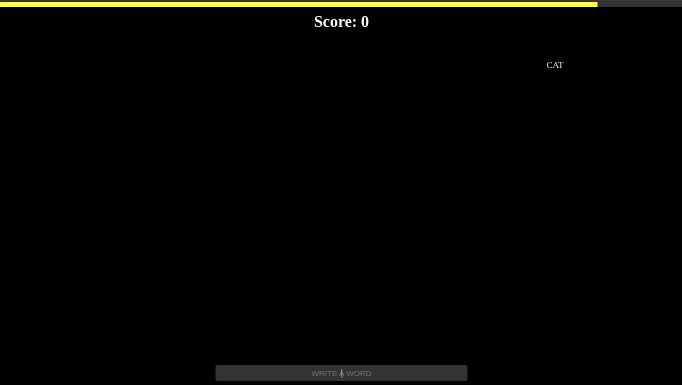

# Snow effect

#### Тежина: <span style="color: yellow">Средна</span>

Во оваа вежба, ќе креирате индикатор и состојба за вчитување користејќи ја библиотеката anime.js. Ќе дизајнирате визуелно привлечни и функционални индикатори кои обезбедуваат повратни информации до корисникот за напредокот на тековните задачи или процеси. Следете ги упатствата и користете ги обезбедените ресурси и совети за да ја завршите вежбата.

### Почетен код

```html
<!doctype html>
<html lang="en">
  <head>
    <meta charset="UTF-8" />
    <meta name="viewport" content="width=device-width, initial-scale=1.0" />
    <title>Snow effect</title>

    <script src="https://cdnjs.cloudflare.com/ajax/libs/animejs/3.2.2/anime.min.js"></script>

    <style>
      body {
        background-color: #000;
        overflow: hidden;
      }

      .snegulka {
        position: absolute;
        width: 10px;
        height: 10px;
        background-color: #fff;
        border-radius: 50%;
      }
    </style>
  </head>

  <body>
    <div id="snegulki"></div>
  </body>

  <script>
    // TODO: Add your code here
  </script>
</html>
```

### Очекуван резултат


### Корисни ресурси и насоки

### Решение

```html
<!doctype html>
<html lang="en">
  <head>
    <meta charset="UTF-8" />
    <meta name="viewport" content="width=device-width, initial-scale=1.0" />
    <title>Snow effect</title>

    <script src="https://cdnjs.cloudflare.com/ajax/libs/animejs/3.2.2/anime.min.js"></script>

    <style>
      body {
        background-color: #000;
        overflow: hidden;
      }

      .snegulka {
        position: absolute;
        width: 10px;
        height: 10px;
        background-color: #fff;
        border-radius: 50%;
      }
    </style>
  </head>

  <body>
    <div id="snegulki"></div>
  </body>

  <script>
    const container = document.getElementById("snegulki");

    for (let i = 0; i < 250; i++) {
      const snegulka = document.createElement("div");
      snegulka.classList.add("snegulka");
      container.appendChild(snegulka);

      snegulka.style.left = anime.random(0, window.innerWidth) + "px";
    }

    anime({
      targets: ".snegulka",
      translateY: [-50, window.innerHeight - 25],
      scale: () => anime.random(0.5, 1.5),
      easing: "linear",
      duration: 3000,
      delay: (el, i) => i * 100,
      loop: true,
    });
  </script>
</html>
```

## Дополнителни барања

### Барање 1: Игра со зборови



```html
<!doctype html>
<html lang="en">
  <head>
    <meta charset="UTF-8" />
    <meta name="viewport" content="width=device-width, initial-scale=1.0" />
    <title>Word game</title>

    <script src="https://cdnjs.cloudflare.com/ajax/libs/animejs/3.2.2/anime.min.js"></script>

    <style>
      body {
        background-color: #000;
        overflow: hidden;
      }

      .word {
        position: absolute;
        color: #fff;
        font-size: large;
        text-transform: uppercase;
      }

      h1 {
        color: white;
        text-align: center;
      }

      #inputGuess {
        position: absolute;
        bottom: 10px;
        left: 50%;
        transform: translateX(-50%);
        width: 500px;
        height: 30px;
        font-size: 16px;
        color: white;
        text-align: center;
        background-color: #333;
        border: none;
        border-radius: 5px;
        outline: none;
        text-transform: uppercase;
      }

      #timer {
        position: absolute;
        top: 0;
        left: 0;
        width: 100%;
        height: 10px;
        background-color: #333;
      }

      #timer .progress {
        background-color: yellow;
        height: 100%;
      }

      #gameStatus {
        position: absolute;
        top: 50px;
        left: 50%;
        transform: translateX(-50%);
        width: 100%;
        height: 100%;
        font-size: 72px;
        color: white;
        text-align: center;
      }
    </style>
  </head>

  <body>
    <div id="timer">
      <div class="progress"></div>
    </div>

    <h1>Score: <span id="score">0</span></h1>

    <div id="words"></div>

    <span id="gameStatus"></span>

    <input
      id="inputGuess"
      type="text"
      placeholder="Write a word"
      autocomplete="off"
    />
  </body>

  <script>
    class WordGame {
      constructor(words) {
        this.words = words;

        this.container = document.getElementById("words");
        this.input = document.getElementById("inputGuess");
        this.scoreElement = document.getElementById("score");
        this.gameStatusElement = document.getElementById("gameStatus");

        this.activeWordElements = [];

        this.timerDuration = 10000;
        this.wordSpawnIntervalLength = 1000;
        this.wordFallDuration = 5000;
        this.pointsToWin = 20;

        this.timerAnimation = anime({
          targets: "#timer .progress",
          width: ["100%", "0%"],
          easing: "linear",
          duration: this.timerDuration,
          complete: () => this.gameOver(),
        });

        this.input.addEventListener("input", () => this.checkInput());
        this.input.focus();

        this.wordSpawnInterval = setInterval(
          () => this.spawnWord(),
          this.wordSpawnIntervalLength,
        );
      }

      spawnWord() {
        const wordEl = document.createElement("div");
        wordEl.classList.add("word");
        const randomIndex = anime.random(0, this.words.length - 1);
        wordEl.innerText = this.words[randomIndex];
        wordEl.style.left = anime.random(100, window.innerWidth - 100) + "px";

        this.container.appendChild(wordEl);
        this.activeWordElements.push(wordEl);

        anime({
          targets: wordEl,
          translateY: [0, window.innerHeight],
          easing: "linear",
          duration: this.wordFallDuration,
          complete: () => {
            wordEl.remove();
            this.activeWordElements.splice(
              this.activeWordElements.indexOf(wordEl),
              1,
            );
          },
        });
      }

      checkInput() {
        const inputValue = this.input.value.toLowerCase();

        this.activeWordElements.forEach((wordEl) => {
          const word = wordEl.innerText.toLowerCase();

          if (word === inputValue) {
            this.correctGuess(wordEl);
          } else if (word.startsWith(inputValue)) {
            wordEl.style.color = "yellow";
          } else {
            wordEl.style.color = "red";
          }
        });
      }

      correctGuess(wordEl) {
        this.input.value = "";
        this.input.focus();

        const points = anime.random(1, 5);
        const score = Number(this.scoreElement.innerText) + points;
        this.scoreElement.innerText = score;

        anime({
          targets: wordEl,
          color: ["#ff0", "#0f0"],
          scale: [1, 1.5, 0],
          duration: 1000,
          easing: "easeInOutQuad",
          complete: () => {
            wordEl.remove();
          },
        });

        if (score >= this.pointsToWin) {
          this.gameWon();
        } else {
          this.timerAnimation.pause();
          this.timerAnimation.seek(
            this.timerAnimation.currentTime - points * 1000,
          );
          this.timerAnimation.play();
        }
      }

      gameOver() {
        this.input.disabled = true;
        anime.remove(".word");
        this.activeWordElements.forEach((wordEl) => wordEl.remove());
        this.timerAnimation.pause();
        this.gameStatusElement.innerText = "Game over!";
        clearInterval(this.wordSpawnInterval);
      }

      gameWon() {
        this.input.disabled = true;
        anime.remove(".word");
        this.activeWordElements.forEach((wordEl) => wordEl.remove());
        this.timerAnimation.pause();
        this.gameStatusElement.innerText = "You won!";
        clearInterval(this.wordSpawnInterval);
      }
    }

    const wordsJSON =
      '["Apple","FINKI","Instagram","Samsung","Cat","Dog","Elephant","Guitar","Butterfly","Rainbow","Computer","Journey","Adventure","Chocolate","Mountain","Fireworks","Universe","Waterfall","Treasure","Sunflower","Dragonfly","Happiness","Whisper","Serenade","Wonderful","Harmony"]';
    const words = JSON.parse(wordsJSON);

    const game = new WordGame(words);
  </script>
</html>
```
